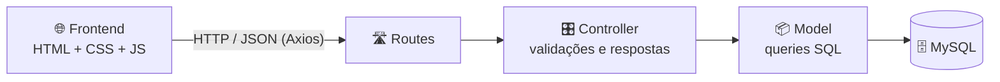
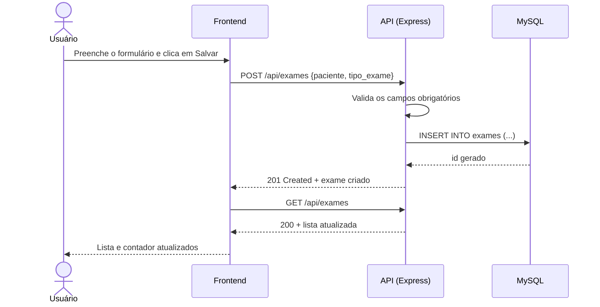

<div align="center">

# 🧪 Exames

**Cadastro de exames laboratoriais com API REST, banco MySQL e interface web.**


*Trabalho avaliativo 1 — Programação para Internet 2*

</div>

---

## 📑 Sumário

- [Sobre o projeto](#-sobre-o-projeto)
- [Funcionalidades](#-funcionalidades)
- [Tecnologias](#-tecnologias)
- [Arquitetura](#-arquitetura)
- [Estrutura de pastas](#-estrutura-de-pastas)
- [Como executar](#-como-executar)
- [Documentação da API](#-documentação-da-api)
- [Como o frontend funciona](#-como-o-frontend-funciona)
- [Boas práticas aplicadas](#-boas-práticas-aplicadas)
- [Problemas comuns](#-problemas-comuns)
- [Melhorias futuras](#-melhorias-futuras)
- [Autor](#-autor)

---

## 📋 Sobre o projeto

O **Exames** é uma aplicação web para controlar exames laboratoriais. Cada exame possui um **paciente**, um **tipo de exame** (ex.: Hemograma) e um **status** (`Pendente` ou `Realizado`).

O projeto é dividido em três camadas independentes:

| Camada | Responsabilidade |
|---|---|
| **Frontend** | Interface no navegador: formulário, lista e contador |
| **Backend** | API REST em Node.js/Express com regras e validações |
| **Banco de dados** | MySQL, onde os exames ficam armazenados |

<!--
📸 Dica: adicione um print da aplicação aqui.
Salve a imagem em uma pasta (ex.: docs/screenshot.png) e descomente a linha abaixo.


-->

---

## ✨ Funcionalidades

- ➕ **Cadastrar** exame (paciente e tipo; o status começa como *Pendente*)
- 📃 **Listar** todos os exames cadastrados
- ✏️ **Editar** paciente e tipo de um exame (o status é preservado)
- ✅ **Concluir / reabrir** exame (alterna entre *Pendente* ⇄ *Realizado*) com um checkbox
- 🗑️ **Excluir** exame, com confirmação antes de apagar
- 🔢 **Contador** de exames realizados (ex.: `2/5`), sempre sincronizado com a lista
- 🎨 **Badge colorido** de status: amarelo para pendente, verde para realizado
- 📱 **Layout responsivo**, que se adapta a telas pequenas
- ⚠️ **Mensagens de erro** quando a API está fora do ar ou a operação falha

---

## 🛠️ Tecnologias

| Camada | Tecnologias |
|---|---|
| Backend | Node.js, Express 5, mysql2, cors, dotenv, nodemon |
| Banco de dados | MySQL |
| Frontend | HTML5, CSS3, JavaScript (Vanilla), Axios |

---

## 🏗️ Arquitetura

O backend segue o padrão **MVC** (Routes → Controller → Model):



| Arquivo | Papel |
|---|---|
| `server.js` | Inicia o Express, ativa CORS e JSON, registra as rotas |
| `routes/` | Liga cada URL + método HTTP a uma função do controller |
| `controllers/` | Valida os dados recebidos e escolhe o código HTTP da resposta |
| `models/` | Único ponto que conversa com o banco de dados |
| `config/db.js` | Cria o *pool* de conexões com o MySQL |

### Fluxo de uma requisição (exemplo: cadastrar exame)



---

## 📁 Estrutura de pastas

```
Exames/
├── backend/
│   ├── bd.sql                          # Script de criação do banco e da tabela
│   ├── .env                            # Variáveis de ambiente (não vai para o Git)
│   ├── package.json
│   └── src/
│       ├── server.js                   # Ponto de entrada da API
│       ├── config/
│       │   └── db.js                   # Pool de conexões MySQL
│       ├── routes/
│       │   └── examesRoutes.js         # Definição das rotas
│       ├── controllers/
│       │   └── examesControllers.js    # Validações e respostas HTTP
│       └── models/
│           └── examesModels.js         # Acesso ao banco (SQL)
└── frontend/
    ├── index.html                      # Estrutura da página
    ├── style.css                       # Estilos
    └── script.js                       # Lógica da interface e chamadas à API
```

---

## 🚀 Como executar

### Pré-requisitos

- [Node.js](https://nodejs.org/) **18 ou superior**
- [MySQL](https://dev.mysql.com/downloads/) instalado e em execução
- [Git](https://git-scm.com/) (para clonar o repositório)

### 1️⃣ Clonar o repositório

```bash
git clone https://github.com/SEU-USUARIO/Exames.git
cd Exames
```

> Troque `SEU-USUARIO` pelo seu usuário do GitHub.

### 2️⃣ Criar o banco de dados

Execute o arquivo `backend/bd.sql` no MySQL. Pelo terminal:

```bash
mysql -u root -p < backend/bd.sql
```

Ou, se preferir, copie e rode o conteúdo no MySQL Workbench / DBeaver:

```sql
CREATE DATABASE exames;

USE exames;

CREATE TABLE exames (
    id INT AUTO_INCREMENT PRIMARY KEY,
    paciente VARCHAR(100) NOT NULL,
    tipo_exame VARCHAR(100) NOT NULL,
    status VARCHAR(30) NOT NULL DEFAULT 'Pendente'
);
```

### 3️⃣ Configurar as variáveis de ambiente

Dentro da pasta `backend/`, crie um arquivo chamado `.env`:

```env
DB_HOST=localhost
DB_USER=root
DB_PASSWORD=sua_senha
DB_NAME=exames
PORT=3000
```

| Variável | Descrição | Padrão |
|---|---|---|
| `DB_HOST` | Endereço do servidor MySQL | `localhost` |
| `DB_USER` | Usuário do MySQL | `root` |
| `DB_PASSWORD` | Senha do MySQL | *(vazia)* |
| `DB_NAME` | Nome do banco | `exames` |
| `PORT` | Porta em que a API vai rodar | `3000` |

> 🔒 O `.env` já está no `.gitignore`, então suas credenciais **não** vão para o GitHub. Nunca faça commit dele.

### 4️⃣ Instalar as dependências e iniciar a API

```bash
cd backend
npm install
npm run dev
```

Se tudo deu certo, o terminal mostra:

```
API rodando na porta 3000
```

| Script | O que faz |
|---|---|
| `npm run dev` | Inicia com **nodemon** (reinicia sozinho ao salvar arquivos) |
| `npm start` | Inicia com Node puro (para produção) |

### 5️⃣ Abrir o frontend

Abra o arquivo `frontend/index.html` no navegador (dois cliques nele, ou botão direito → *Abrir com* → navegador).

Se preferir usar um servidor local, também funciona, por exemplo, com a extensão **Live Server** do VS Code.

✅ Pronto! A aplicação está funcionando.

> ⚠️ O frontend chama a API em `http://localhost:3000/api/exames`. Se você mudar a porta no `.env`, altere também a constante `API_URL` no início do `frontend/script.js`.

---

## 📡 Documentação da API

**URL base:** `http://localhost:3000/api`

| Método | Rota | Descrição | Sucesso | Erros |
|---|---|---|---|---|
| `POST` | `/exames` | Cadastra um exame | `201` | `400`, `500` |
| `GET` | `/exames` | Lista todos os exames | `200` | `500` |
| `PUT` | `/exames/:id` | Atualiza um exame | `200` | `400`, `404`, `500` |
| `DELETE` | `/exames/:id` | Exclui um exame | `204` | `404`, `500` |

### Códigos de resposta

| Código | Significado |
|---|---|
| `200` | OK |
| `201` | Criado com sucesso |
| `204` | Excluído com sucesso (sem corpo na resposta) |
| `400` | Requisição inválida (campo obrigatório ausente) |
| `404` | Registro não encontrado |
| `500` | Erro interno do servidor |

### Exemplos

<details>
<summary><b>➕ POST /exames — cadastrar</b></summary>

O campo `status` **não** é necessário: o exame sempre nasce como `Pendente`.

**Requisição**
```bash
curl -X POST http://localhost:3000/api/exames \
  -H "Content-Type: application/json" \
  -d '{"paciente": "Maria Silva", "tipo_exame": "Hemograma"}'
```

**Resposta `201`**
```json
{
  "id": 1,
  "paciente": "Maria Silva",
  "tipo_exame": "Hemograma",
  "status": "Pendente"
}
```

**Erro `400`** (campo ausente)
```json
{ "erro": "Paciente e tipo de exame são obrigatórios" }
```
</details>

<details>
<summary><b>📃 GET /exames — listar</b></summary>

**Requisição**
```bash
curl http://localhost:3000/api/exames
```

**Resposta `200`**
```json
[
  {
    "id": 1,
    "paciente": "Maria Silva",
    "tipo_exame": "Hemograma",
    "status": "Pendente"
  },
  {
    "id": 2,
    "paciente": "João Souza",
    "tipo_exame": "Glicemia",
    "status": "Realizado"
  }
]
```
</details>

<details>
<summary><b>✏️ PUT /exames/:id — atualizar</b></summary>

Os **três campos** são obrigatórios (inclusive `status`).

**Requisição**
```bash
curl -X PUT http://localhost:3000/api/exames/1 \
  -H "Content-Type: application/json" \
  -d '{"paciente": "Maria Silva", "tipo_exame": "Hemograma", "status": "Realizado"}'
```

**Resposta `200`**
```json
{
  "id": 1,
  "paciente": "Maria Silva",
  "tipo_exame": "Hemograma",
  "status": "Realizado"
}
```

**Erro `400`** (campo ausente)
```json
{ "erro": "Paciente, tipo de exame e status são obrigatórios" }
```

**Erro `404`** (id inexistente)
```json
{ "erro": "Registro não encontrado" }
```
</details>

<details>
<summary><b>🗑️ DELETE /exames/:id — excluir</b></summary>

**Requisição**
```bash
curl -X DELETE http://localhost:3000/api/exames/1
```

**Resposta `204`** — sem corpo.

**Erro `404`** (id inexistente)
```json
{ "erro": "Registro não encontrado" }
```
</details>

---

## 🖥️ Como o frontend funciona

O `script.js` mantém duas informações em memória:

| Variável | Função |
|---|---|
| `exames` | Cópia local da lista recebida da API |
| `editingExameId` | `null` = modo **cadastro**; com um id = modo **edição** |

### Fluxos principais

| Ação | O que acontece |
|---|---|
| **Abrir a página** | `fetchExames()` faz `GET /exames` e `renderExames()` desenha a lista e o contador |
| **Salvar (novo)** | `POST /exames` → limpa o formulário → recarrega a lista |
| **Editar** | `prepareEdit()` preenche o formulário, troca o título para *"Edite o exame"* e mostra o botão **Cancelar**. Ao salvar, faz `PUT /exames/:id` mantendo o status atual |
| **Cancelar** | `resetForm()` volta ao modo cadastro, sem chamar a API |
| **Marcar / desmarcar "Realizado"** | `toggleExame()` faz `PUT` alternando o status entre `Realizado` e `Pendente` e recarrega a lista |
| **Excluir** | Pede confirmação com `confirm()` → `DELETE /exames/:id` → recarrega a lista |
| **Contador** | Calculado em `renderExames()`: quantos têm status `Realizado` ÷ total |

---

## 🛡️ Boas práticas aplicadas

- **Pool de conexões** (`connectionLimit: 10`): reaproveita conexões em vez de abrir uma por requisição.
- **Queries parametrizadas** (`?`): protegem contra **SQL Injection**.
- **`textContent` ao exibir dados do usuário**: protege contra **XSS**, pois o texto digitado nunca é interpretado como HTML.
- **Validação em duas camadas**: no navegador (`required`, `maxlength`, `trim`) e na API (respostas `400`).
- **Códigos HTTP semânticos**: `201`, `204`, `400`, `404` e `500` usados nos casos corretos.
- **Separação de responsabilidades (MVC)**: rotas, controller e model em arquivos distintos.
- **Credenciais fora do código**: configuração via `.env`, ignorado pelo Git.
- **Tratamento de erros** com `try/catch` em todas as operações assíncronas.

---

## 🩺 Problemas comuns

<details>
<summary><b>"Falha de conexão com a API." aparece na tela</b></summary>

- Confirme que a API está rodando (`npm run dev` dentro de `backend/`).
- Verifique se a porta do `.env` é a mesma de `API_URL` no `script.js`.
- Abra `http://localhost:3000/api/exames` no navegador: deve aparecer uma lista em JSON (mesmo que vazia: `[]`).
</details>

<details>
<summary><b><code>ER_ACCESS_DENIED_ERROR</code> (acesso negado)</b></summary>

Usuário ou senha do MySQL incorretos no `.env`. Confira `DB_USER` e `DB_PASSWORD`.
</details>

<details>
<summary><b><code>ER_BAD_DB_ERROR: Unknown database 'exames'</code></b></summary>

O banco ainda não foi criado. Rode o `backend/bd.sql` (passo 2).
</details>

<details>
<summary><b><code>ER_NO_SUCH_TABLE</code></b></summary>

O banco existe, mas a tabela não. Rode o script `bd.sql` completo.
</details>

<details>
<summary><b><code>EADDRINUSE</code> (porta em uso)</b></summary>

Outro programa já usa a porta 3000. Troque `PORT` no `.env` (e a `API_URL` no `script.js`) ou encerre o outro processo.
</details>

<details>
<summary><b><code>npm</code> não é reconhecido</b></summary>

O Node.js não está instalado ou não está no PATH. Instale em [nodejs.org](https://nodejs.org/) e reabra o terminal.
</details>

---

## 👤 Autor

Feito por **Tioski** — Programação para Internet 2.

[](https://github.com/SEU-USUARIO)
